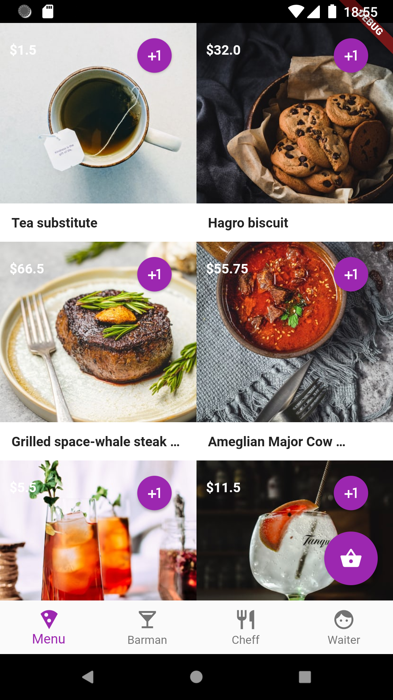

# Restaurant App

A Flutter App to manage restaurant orders.

This project manage a restaurant orders and how are those orders served by it's stuff.

## Roles
- CLient
- Barman
- Cheff
- Waiter
- Manager

## Status

Order:
- just_created
- ready
- in_process
- serving
- done
- canceled
  
Product:
- ordered
- in_process
- ready_to_serve,
- serving
- canceled
- out_of_stock

## Screens

On start the user creates an order with the status "just_created".

### Menu
This is the screen where the client will see the available products and can add products to his order.
When he is happy with the order can go to next screen.

#### OrderScreen
Here the order is avaiable for the client to update it before to send. 
After send the order goes to next workflow step: ready

### Barman
Here the barman will see a list of orders with drinks ready to be prepare sort by time.
So he can serve the first one creted.
For each drink he has different statuses. When he starts to prepare a drink he can put in_process.
When he finish one drink he can set it ready_to_serve.
When all drinks from an order and ready_to_serve => order will appear on the waiter screen.
If a drink can not be prepared because is missing an ingredient, for example gin, it can be marked as out_of_stock and manager will be able to see it at his screen.

### Cheff
Exactly the same as the barman but show products of type food

### Waiter
In this screen the waiter can see the orders sort by day time that are ready to serve.
So they can mark an order as serving as soon as one type of prodcuts are ready like drinks and when all prodcuts are served can mark as done.

### Manager
Can see the total list of orders by day
Can see which professional did what and create reports
Can see the out of stock products like botles or ingredients, so he can order to refill them.

## Database
Project uses backend but it is decouple so It can be replaced with any other database just changing the datasource and models from the data layer.
It needs a google-services.json file to work with Firebase.
An example of a product and order in json format can be found on the text/fixture folder.

